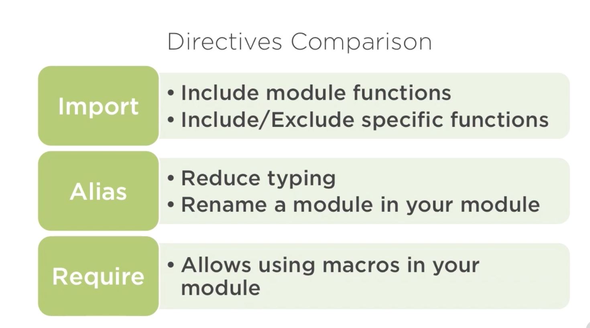

# Readme

built on erlang
high availability

it can :
monitor and restart

## what is elixir
- utf strings
- pattern matching
- concurrency
- metaprogramming (macros)

## Topics of computer languages
- basics
- modules & functions
- control flow
- ecosystem

## iex
- type iex to enter
- type h to get help

## Data Types

### integers

### atoms (aka symbols)

### strings (UTF-8)
strings are binary

### tuples
typically used for 2, 3, or 4 values

Getting specific values from a tuple is Elem function

### lists
Useful for more than a handful of values

### Maps

- key does not have to be an atom. maps require same key. more efficient

A map looks like `%{}`

## Return values
- { :ok, content }
- { :error, reason }

## Pattern matching

the equal sign ('=') is not assignment but pattern matching.

## benefiuts of immuatiability

- concurnecey

## Functions

### helpful functions
- hd
- elem
- tl
- List.insert_at


### Kernal
The kernal module is imported into every module.


### Directives
`import` is how to bring in functions from another module

`alias` is how to import, yet rename a module

`require`



## Pattern Matching

Elixir Supports, even encourages, naming functions the same name. THe difference is the number of arguments passed.

## Guard Clauses

## Anonymous Functions
there are two types:
- lambda style
- capture style

Capture style is a new concept which looks like this:

```
  list = [1,2,3,4]
  Enum.map(list, fn(x) -> x*x end)
  Enum.reduce(list, 0, fn(x, acc) -> acc + x end)

  Enum.map(list, &(&1 * &1))
  Enum.reduce(list, 0, &(&1 + &2))
```